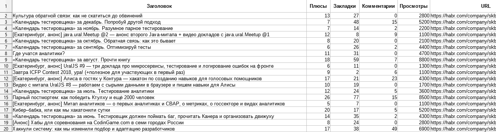
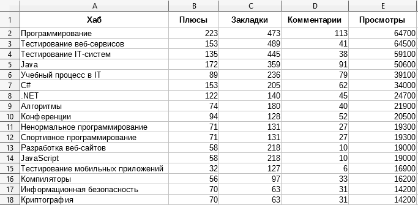
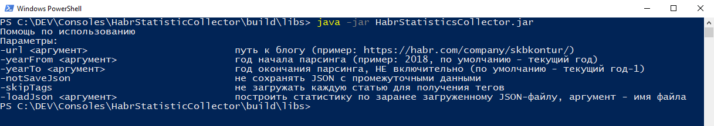

# Собиралка статистики по конкретному хабрахабр-блогу

Парсит информацию по выбранному блогу на сайте [Хабрахабр](https://habr.com/). Генерирует пачку файлов со всякой статистикой:
* CSV, которые потом можно открыть с помощью чего-нибудь типа Excel или LibreOffice Calc, строить графики и всё такое
* JSON, которые (наверное) порадуют программистов

# Пример содержимого

[крупный план скриншота 1](https://raw.githubusercontent.com/Newbilius/HabrStatisticCollector/master/readme_pics/data1.png)

Внимательней посмотреть на получаемую информацию можно [вот тут](exampleData).

# Как использовать

Для нужна установленная [Java](https://www.oracle.com/technetwork/java/javase/downloads/index.html).
Готовая программа уже собрана из исходников, [скачать можно тут](https://github.com/Newbilius/HabrStatisticCollector/releases).
Там же есть и примеры использования.

# Чего интересненького в коде?

* Собственная [парсилка параметров командной строки](src/main/java/com/newbilius/HabrStatisticCollector/CommandLineParser) - потому что нашлась куча вариантов, но все попадавшиеся не имели локализации, а я хотел русскую справку (ну и не без фатального недостатка конечно не обошлось)
* [Генераторы статистики](src/main/java/com/newbilius/HabrStatisticCollector/AnalyticsGenerators) по уже скачанным данным вызываются рефлексией, так что для добавления своего генератора достаточно отнаследоваться от **IAnalyticsGenerator**
